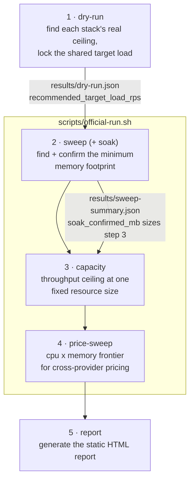

# Slashbench

A reproducible benchmark testing whether Rust backends actually cost less to run in the cloud than JVM/JS backends serving the same workload — built for the JavaZone 2026 talk "Rust will slash your backend costs."

Full methodology, experimental design, and timeline: see [`CLAUDE.md`](./CLAUDE.md).

## Status

All six stacks (Rocket, Actix-web, Spring Java, Spring Kotlin, Node+Hono, Bun+Hono) are implemented and containerized. The CLI orchestrator (`dry-run`/`sweep`/`soak`/`capacity`/`price-sweep`/`report`) is built and validated; see `CLAUDE.md` for the full progress log and current open items.

## The measurement pipeline

Five CLI subcommands run in a fixed order, each one's output feeding the next. `dry-run` and `report` are run manually, once each; `sweep`, `capacity`, and `price-sweep` are chained automatically by `scripts/official-run.sh`.



| # | Command | What it does | Why | Rough time, all 6 stacks* |
|---|---|---|---|---|
| 1 | `dry-run` | Runs each stack **uncapped** up an ascending request-rate ladder to find its real max sustainable throughput (highest rate with p99 < 200ms, errors < 1%). | Calibrates the *one* shared load every other step tests at — anchored to the **weakest** stack (60% of its ceiling) so the target is achievable for all six, not just the fastest. | ~15–30 min |
| 2 | `sweep` (runs `soak` internally) | At the fixed target load, steps memory down (CPU held at 1 vCPU) until the SLA breaks, then **soak-confirms** the floor with a sustained 10-minute load test — a footprint that only survives a short burst doesn't count. | This is the project's actual headline number: the minimum memory each stack genuinely needs under real sustained load. Directly tests the hypothesis the whole benchmark exists to check. | ~1–2+ hours (the slowest, most variable stage — every candidate needs a full 10-minute soak, and a failed one means retrying at the next rung up) |
| 3 | `capacity` | At **one fixed** resource size (the largest footprint any stack needed in step 2, so all six fit comfortably), walks the same rate ladder as `dry-run` to find each stack's throughput ceiling *at that size*. | Answers the complementary question: not "how little can it get away with," but "for the same fixed cloud bill, how much traffic can each stack actually handle." | ~15–30 min |
| 4 | `price-sweep` | At the target load, sweeps **both** CPU (1.0 → 0.08 vCPU) and memory together to map the cheapest (cpu, mem) combination meeting the SLA at each CPU level. Burst-only, not soak-confirmed. | Several providers' cheaper billing tiers allow fractional CPU (unlike Cloud Run's instance-based 1-vCPU floor) — this is the only step that can find a genuinely cheaper config by trading CPU for memory. Feeds the report's cross-provider pricing chart. | ~20 min–several hours (most unpredictable — depends on how many memory rungs each of the 5 CPU levels needs) |
| 5 | `report` | Reads everything under `results/` and generates a self-contained static HTML report (methodology, cost charts, per-stack detail charts). | Turns raw JSON/JSONL into the actual deliverable. Safe to re-run any time; degrades gracefully for stacks not yet measured. | seconds |

\* Order-of-magnitude estimates under the current defaults (single-pass measurements, 10-minute soak — see CLAUDE.md's Aug 19 progress log for why). Real timing varies a lot with how many ladder rungs each stack needs to walk before failing; treat these as planning numbers, not guarantees.

The standalone `soak` command (step 2's engine) can also be run directly against one stack — useful for spot-checking a specific result without re-running the whole sweep, e.g. if a number looks suspicious: `slashbench soak --stack rocket --mem-mb 16`.

## Running a stack locally

```bash
docker compose --profile rocket up -d --build
curl "http://localhost:8080/items?page=1&limit=3"
```

Reseed the dataset (100k rows) between runs:

```bash
./scripts/reseed.sh
```
