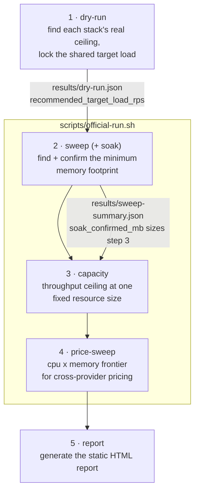

# Slashbench

A reproducible benchmark testing whether Rust backends actually cost less to run in the cloud than JVM/JS backends serving the same workload — built for the JavaZone 2026 talk "Rust will slash your backend costs."

Full methodology, experimental design, and timeline: see [`CLAUDE.md`](./CLAUDE.md).

## Status

All six stacks (Rocket, Actix-web, Spring Java, Spring Kotlin, Node+Hono, Bun+Hono) are implemented and containerized. The CLI orchestrator (`dry-run`/`sweep`/`soak`/`capacity`/`price-sweep`/`report`) is built and validated; see `CLAUDE.md` for the full progress log and current open items.

## The measurement pipeline

Five CLI subcommands run in a fixed order, each one's output feeding the next. `dry-run` and `report` are run manually, once each; `sweep`, `capacity`, and `price-sweep` are chained automatically by `scripts/official-run.sh`.



| # | Command | What it does | Why | Rough time, all 6 stacks* |
|---|---|---|---|---|
| 1 | `dry-run` | Runs each stack **uncapped** up an ascending request-rate ladder to find its real max sustainable throughput (highest rate with p99 < 200ms, errors < 1%). | Calibrates the *one* shared load every other step tests at — anchored to the **weakest** stack (60% of its ceiling) so the target is achievable for all six, not just the fastest. | ~15–30 min |
| 2 | `sweep` (runs `soak` internally) | At the fixed target load, steps memory down (CPU held at 1 vCPU) until the SLA breaks, then **soak-confirms** the floor with a sustained 10-minute load test — a footprint that only survives a short burst doesn't count. | This is the project's actual headline number: the minimum memory each stack genuinely needs under real sustained load. Directly tests the hypothesis the whole benchmark exists to check. | ~1–2+ hours (the slowest, most variable stage — every candidate needs a full 10-minute soak, and a failed one means retrying at the next rung up) |
| 3 | `capacity` | At **one fixed** resource size (the largest footprint any stack needed in step 2, so all six fit comfortably), walks the same rate ladder as `dry-run` to find each stack's throughput ceiling *at that size*. | Answers the complementary question: not "how little can it get away with," but "for the same fixed cloud bill, how much traffic can each stack actually handle." | ~15–30 min |
| 4 | `price-sweep` | At the target load, sweeps **both** CPU (1.0 → 0.08 vCPU) and memory together to map the cheapest (cpu, mem) combination meeting the SLA at each CPU level. Burst-only, not soak-confirmed. | Several providers' cheaper billing tiers allow fractional CPU (unlike Cloud Run's instance-based 1-vCPU floor) — this is the only step that can find a genuinely cheaper config by trading CPU for memory. Feeds the report's cross-provider pricing chart. | ~20 min–several hours (most unpredictable — depends on how many memory rungs each of the 5 CPU levels needs) |
| 5 | `report` | Reads everything under `results/` and generates a self-contained static HTML report (methodology, cost charts, per-stack detail charts). | Turns raw JSON/JSONL into the actual deliverable. Safe to re-run any time; degrades gracefully for stacks not yet measured. | seconds |

\* Order-of-magnitude estimates under the current defaults (single-pass measurements, 10-minute soak — see CLAUDE.md's Aug 19 progress log for why). Real timing varies a lot with how many ladder rungs each stack needs to walk before failing; treat these as planning numbers, not guarantees.

The standalone `soak` command (step 2's engine) can also be run directly against one stack — useful for spot-checking a specific result without re-running the whole sweep, e.g. if a number looks suspicious: `slashbench soak --stack rocket --mem-mb 16`.

## Running a stack locally

```bash
docker compose --profile rocket up -d --build
curl "http://localhost:8080/items?page=1&limit=3"
```

Reseed the dataset (100k rows) between runs:

```bash
./scripts/reseed.sh
```

## Running the official pipeline on cloud VMs

The official runs use a three-VM topology per cloud — **target** (runs the stack under test), **load-gen** (runs the CLI + k6, orchestrates target/postgres over SSH), **postgres** (its own VM, isolated so its CPU never shares a host with — and confounds — the app's own measured CPU/memory; see CLAUDE.md's Aug 19 diagnostic). This has been set up on both Scaleway and GCP; either is a valid reference for reproducing it.

**Security posture, non-negotiable on any cloud**: only SSH (22) is ever reachable from the public internet, secured by key-only auth (no password auth). The app port (8080) and Postgres (5432) must **never** be publicly reachable — only over the cloud's private/internal network between the three VMs. Verify this after setup with a plain TCP connect attempt from outside the cloud (should time out, not refuse):

```bash
python3 -c "
import socket
s = socket.socket(socket.AF_INET, socket.SOCK_STREAM); s.settimeout(5)
try:
    s.connect(('<target-public-ip>', 8080)); print('OPEN - fix this')
except socket.timeout:
    print('unreachable (correct)')
"
```

### Provisioning

**Scaleway**: three `STANDARD3-X4C-16G` (4 vCPU/16GB, dedicated cores — not `BASIC3`, to avoid noisy-neighbor CPU contention) instances, Debian 12, same region (`fr-par-1` used here). Attach all three to a Private Network so they get private IPs for inter-VM traffic:

```bash
scw vpc private-network create name=slashbench-private region=fr-par project-id=<project-id>
scw instance private-nic create server-id=<target-id> private-network-id=<pn-id> zone=fr-par-1
scw instance private-nic create server-id=<loadgen-id> private-network-id=<pn-id> zone=fr-par-1
scw instance private-nic create server-id=<postgres-id> private-network-id=<pn-id> zone=fr-par-1
```

Then lock the security group down — allow only SSH publicly, default-drop everything else (do the allow rule *first*, verify SSH still works, *then* set the drop policy, to avoid locking yourself out mid-change):

```bash
scw instance security-group create-rule security-group-id=<sg-id> action=accept protocol=TCP direction=inbound dest-port-from=22 ip-range=0.0.0.0/0 zone=fr-par-1
# verify SSH access still works here before continuing
scw instance security-group update <sg-id> inbound-default-policy=drop
```

**GCP**: three `n2-standard-4` (4 vCPU/16GB, dedicated cores — not `e2`, which is shared-core) instances, Debian 12, same region (`europe-west9-a`/Paris used here, to roughly match Scaleway's `fr-par-1`):

```bash
gcloud compute instances create slashbench-target-gcp slashbench-loadgen-gcp slashbench-postgres-gcp \
  --project=<project-id> --zone=europe-west9-a --machine-type=n2-standard-4 \
  --image-family=debian-12 --image-project=debian-cloud --boot-disk-size=30GB --boot-disk-type=pd-balanced
```

No firewall changes needed on GCP — its default VPC already has `default-allow-internal` (covers all inter-VM traffic on private IPs) and `default-allow-ssh` (scoped to exactly `tcp:22` publicly), which is exactly the posture above. Just make sure app/DB traffic uses each VM's **internal** IP, never its external one.

### Software setup (same on both clouds)

- **target/postgres VMs**: Docker Engine via the official convenience script (`curl -fsSL https://get.docker.com | sudo sh`), add the user to the `docker` group.
- **load-gen VM**: Docker CLI only (no daemon needed — it drives target/postgres via `DOCKER_HOST=ssh://...`), [k6](https://k6.io) (the documented `packages.k6.io/key.gpg` key URL no longer resolves — use `https://dl.k6.io/key.gpg` instead), Rust via rustup (`build-essential`/`pkg-config`/`libssl-dev` needed first for `openssl-sys`), then build the CLI natively on this VM (`cargo build --release` in `cli/`) rather than cross-compiling.
- Clone this repo onto all three VMs at the same path — bind-mount paths in `docker-compose.yml` resolve on whichever machine the Docker *daemon* runs on, so target/postgres each need their own copy of `db/*.sql` etc.
- Generate a dedicated SSH keypair on load-gen and authorize it on target/postgres, to drive the `DOCKER_HOST=ssh://` bridge and the Postgres-VM routing.

### Running against the private IPs

Every `slashbench` command (and `scripts/official-run.sh`) picks up its target host purely from environment variables — run these from the load-gen VM, using each VM's **private** IP:

```bash
export DOCKER_HOST=ssh://<user>@<target-private-ip>
export SLASHBENCH_POSTGRES_DOCKER_HOST=ssh://<user>@<postgres-private-ip>
export SLASHBENCH_POSTGRES_HOST=<postgres-private-ip>
export SLASHBENCH_BASE_URL=http://<target-private-ip>:8080
export SLASHBENCH_SKIP_BUILD=1  # use pre-pulled registry images instead of rebuilding every restart
```
